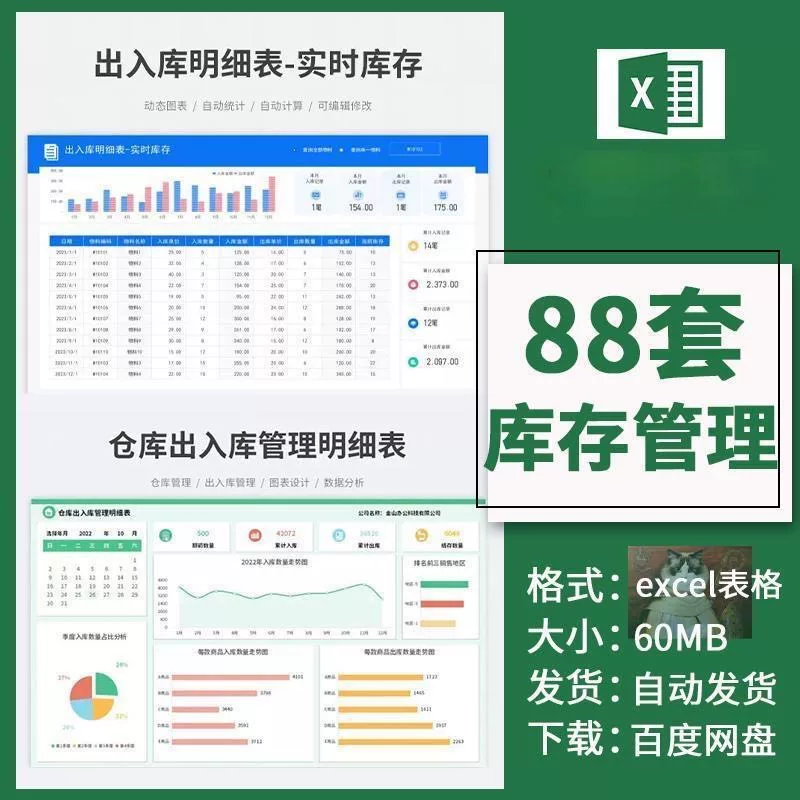

# 1. Dynamic calculation function.

## Body

88 sets of warehouse in and out management detail table, excel format, including dynamic charts, self-
88 sets of warehouse in and out management detail table, excel format, including dynamic charts, automatic statistics, calculation functions.

Real-time inventory reminders, suitable for warehouses and shops.

The file size is 60MB, delivered via Baidu NetEase Cloud. The link will be automatically sent within 24 hours. The content is clear and practical, ready to use right away, helping you enhance your work efficiency!

Fans, hurry and place your order. You can get a 2-piece knife for free, and it's even more advantageous if you pick it up from the same city.

## Images

## Payment

Here is a pay link on Stripe ( https://buy.stripe.com/3cs8yP7sY87d0vu9AB ). Please contact me lonlonago@foxmail.com after funding $89, and I will send you a complete data files , thank you!

